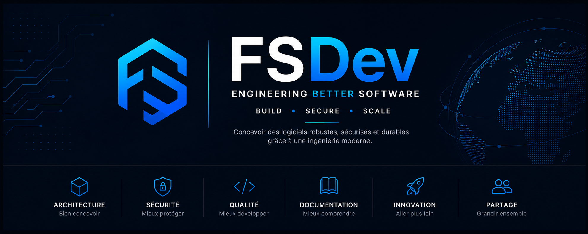

<p align="center">
  
</p>

<h1 align="center">FSDev</h1>

<p align="center">
<strong>Engineering Better Software</strong>
</p>

<p align="center">
Un écosystème d'ingénierie logicielle dédié à la conception de logiciels fiables, sécurisés et durables.
</p>

---

# À propos

FSDev est un écosystème d'ingénierie logicielle dont l'objectif est de concevoir des logiciels robustes, documentés et maintenables.

Chaque projet partage les mêmes principes :

- 🏗️ Architecture réfléchie
- 🛡️ Sécurité dès la conception
- 📚 Documentation de qualité
- ⚙️ Amélioration continue
- 🤝 Solutions pragmatiques

---

# L'écosystème FSDev

```
                        FSDev
                           │
        ┌──────────────────┼──────────────────┐
        │                  │                  │
     🌍 Public          🌍 Public          🔒 Privé
        │                  │                  │
   FSBackup        Engineering         CyberLab
                    Standards
                                            │
                                ├── Radio Lotus
                                ├── EMS
                                └── Devis Express Artisan
```

---

# 🌍 Dépôts publics

## 💾 FSBackup

Solution moderne de sauvegarde conçue pour protéger les données de manière fiable et sécurisée.

➡️ **Découvrir le projet**

https://github.com/ssdfred/FSBackup

---

## 📚 FSDev Engineering Standards

Le référentiel d'ingénierie utilisé pour l'ensemble des projets de l'écosystème.

Il définit :

- les standards de développement ;
- les conventions de code ;
- les modèles de documentation ;
- les ADR ;
- les runbooks ;
- les bonnes pratiques d'architecture.

➡️ **Consulter le référentiel**

https://github.com/ssdfred/FSDev-Engineering-Standards

---

# 🔒 Projets privés

Ces projets font actuellement partie de l'écosystème FSDev mais ne sont pas encore publics.

- 🔐 CyberLab
- 📻 Radio Lotus
- ⚡ EMS
- 📱 Devis Express Artisan

---

# Notre philosophie

Chez FSDev, nous considérons qu'un logiciel ne se résume pas à son code.

Sa qualité repose également sur son architecture, sa documentation, sa sécurité et sa capacité à évoluer dans le temps.

---

# Technologies

### Backend

- Python
- FastAPI
- PHP
- Laravel

### Frontend

- Livewire
- Alpine.js
- Tailwind CSS

### Bases de données

- PostgreSQL
- MariaDB
- MySQL

### DevOps

- Docker
- GitHub Actions
- Linux
- Nginx

---

# Documentation

Découvrez les documents fondateurs de l'écosystème :

- 📖 Brand Identity
- 📜 Manifeste
- 🛣️ Roadmap

---

# Le fondateur

FSDev est un écosystème créé par **Frédéric SMEE**.

Il rassemble plusieurs projets partageant une même vision :

> **Construire des logiciels fiables, documentés, sécurisés et conçus pour durer.**

---

<p align="center">
<b>Engineering Better Software</b>
</p>